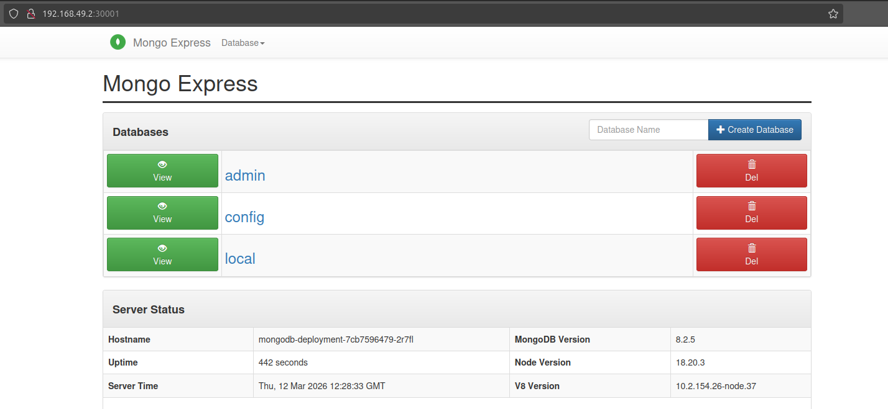

<details>
<summary>Deploy MongoDB and Mongo Express into local K8s cluster</summary>
<br />

**Setup local K8s cluster with Minikube**
In order to ensure that minikube uses a proper K8s cluster, we need to export KUBECONFIG environment variable and start minikube cluster.
```sh
armin@nb-pf565v12:~$ export KUBECONFIG=/home/armin/.kube/minikube.config
armin@nb-pf565v12:~$ echo $KUBECONFIG
/home/armin/.kube/minikube.config
armin@nb-pf565v12:~$ minikube start --driver=docker
😄  minikube v1.37.0 on Linuxmint 22
    ▪ KUBECONFIG=/home/armin/.kube/minikube.config
✨  Using the docker driver based on existing profile
🎉  minikube 1.38.1 is available! Download it: https://github.com/kubernetes/minikube/releases/tag/v1.38.1
💡  To disable this notice, run: 'minikube config set WantUpdateNotification false'

👍  Starting "minikube" primary control-plane node in "minikube" cluster
🚜  Pulling base image v0.0.48 ...
🔄  Restarting existing docker container for "minikube" ...
🐳  Preparing Kubernetes v1.34.0 on Docker 28.4.0 ...
🔎  Verifying Kubernetes components...
    ▪ Using image registry.k8s.io/ingress-nginx/kube-webhook-certgen:v1.6.2
    ▪ Using image gcr.io/k8s-minikube/storage-provisioner:v5
    ▪ Using image registry.k8s.io/ingress-nginx/kube-webhook-certgen:v1.6.2
    ▪ Using image registry.k8s.io/ingress-nginx/controller:v1.13.2
🔎  Verifying ingress addon...
🌟  Enabled addons: default-storageclass, storage-provisioner, ingress

❗  /usr/local/bin/kubectl is version 1.26.0, which may have incompatibilities with Kubernetes 1.34.0.
    ▪ Want kubectl v1.34.0? Try 'minikube kubectl -- get pods -A'
🏄  Done! kubectl is now configured to use "minikube" cluster and "default" namespace by default
```
<br />

**Deploy MongoDB and MongoExpress with configuration and credentials extracted into ConfigMap and Secret**

NOTE: all the configuration files can be found in this repository - https://github.com/armalkoc/twn-demo-projects/tree/master/Module_10/demo_1

In order to create and start mongodb Pod, I created db-secret.yaml file with the needed variables -  https://github.com/armalkoc/twn-demo-projects/blob/master/Module_10/demo_1/db-secret.yaml.

After that I created deployment and service configuration for the mongodb - https://github.com/armalkoc/twn-demo-projects/blob/master/Module_10/demo_1/mongodb-deployment.yaml

At the end we can see our secret and mongodb Pod sucessfully created:
```sh
armin@nb-pf565v12:~/twn-demo-projects/Module_10$ kubectl get secret | grep -i mdb
mdb-secret                               Opaque                           2      27m

armin@nb-pf565v12:~/twn-demo-projects/Module_10$ kubectl get deployment | grep -i mongodb && kubectl get pods | grep -i mongodb 
mongodb-deployment                          1/1     1            1           13m
mongodb-deployment-7cb7596479-2r7fl         1/1     Running      0           13m
```
Now it's needed to create mongo-express deployment and config as well since mongo-express needs mongo database server as a variable. Config file was created https://github.com/armalkoc/twn-demo-projects/blob/master/Module_10/demo_1/db-config.yaml and also both, deployment and service for mongo-express were created https://github.com/armalkoc/twn-demo-projects/blob/master/Module_10/demo_1/mongo-express-deployment.yaml.
After that we can see:
```sh
armin@nb-pf565v12:~/twn-demo-projects/Module_10$ kubectl get deployment | grep -i mongo- && kubectl get pods | grep -i mongo- 
mongo-express-deployment                    1/1     1            1           12m
mongo-express-deployment-69b48dc5f4-ktnsc   1/1     Running      0           12m
```
At the end, since I have to access to the mongo-express UI through my we browser, it means I have to access to the mongo-express external service type LoadBalancer (nodePort 30001). To enable this its needed to do following:
```sh
armin@nb-pf565v12:~/twn-demo-projects/Module_10$ minikube service mongo-express-service
┌───────────┬───────────────────────┬─────────────┬───────────────────────────┐
│ NAMESPACE │         NAME          │ TARGET PORT │            URL            │
├───────────┼───────────────────────┼─────────────┼───────────────────────────┤
│ default   │ mongo-express-service │ 8087        │ http://192.168.49.2:30001 │
└───────────┴───────────────────────┴─────────────┴───────────────────────────┘
```
Now I'm able to access to the mongo-express UI through my web browser:
<br />


<br />
</details>

******

<details>
<summary>Deploy Mosquitto message broker with ConfigMap and Secret Volume Types</summary>
<br />

**Define configuration and passwords for Mosquitto message broker with ConfigMap and Secret Volume types**

In order to properly being started some applications need some configuration parameters during the starting process. These parameters can be e.g. log directory, sensitive data like passwords and usernames, configuration data like database url etc.
To be able to understand the whole topic, we started mosquitto Pod without any volumes, and found configuration directory. Deployment file can be found here - https://github.com/armalkoc/twn-demo-projects/blob/master/Module_10/demo_2/mosquitto-without-volumes.yaml
```sh
armin@nb-pf565v12:~/twn-demo-projects/Module_10/demo_2$ kubectl apply -f mosquitto-without-volumes.yaml 
deployment.apps/mosquitto created

/mosquitto/config # pwd
/mosquitto/config
/mosquitto/config # cd ..
/mosquitto # ls -lrth
total 16K    
drwxr-xr-x    2 mosquitto mosquitto    4.0K Feb  5 17:54 log
drwxr-xr-x    2 mosquitto mosquitto    4.0K Feb  5 17:54 data
drwxr-xr-x    1 mosquitto mosquitto    4.0K Feb  5 17:54 config
```
So we can see that all mosquitto configuration, logs, data etc. are stored in the /mosquitto directory. So lets create Secret and ConfigMap configuration files for mosquitto and mount these files as volumes in the mosquitto Deployment. All those configuration files you can find here - https://github.com/armalkoc/twn-demo-projects/tree/master/Module_10/demo_2 . 
After mosquitto-config-file and mosquitto-secret-file were created, we have created mosquitto deployment and now we can see that we have it running:
```sh
armin@nb-pf565v12:~/twn-demo-projects/Module_10$ kubectl get secret | grep -i mosquitto
mosquitto-secret-file                    Opaque                           1      7m
armin@nb-pf565v12:~/twn-demo-projects/Module_10$ kubectl get configMap | grep -i mosquitto
mosquitto-config-file           1      10m
armin@nb-pf565v12:~/twn-demo-projects/Module_10$ kubectl get pods | grep -i mosquitto
mosquitto-849db7d468-d6dvm                  1/1     Running                      0             3m18s
armin@nb-pf565v12:~/twn-demo-projects/Module_10$ kubectl get deployment | grep -i mosquitto
mosquitto                  1/1     1            1           3m23s
```
When we enter inside the mosquitto container we can see our configuration and secret files as they should be:
```sh
armin@nb-pf565v12:~/twn-demo-projects/Module_10$ kubectl exec -it mosquitto-849db7d468-d6dvm -- sh
/ # cd mosquitto
/mosquitto # ls -lrth
total 12K    
drwxr-xr-x    2 mosquitto mosquitto    4.0K Feb  5 17:54 log
drwxr-xr-x    2 mosquitto mosquitto    4.0K Feb  5 17:54 data
drwxrwxrwt    3 root     root         100 Mar 12 23:53 secret
drwxrwxrwx    3 root     root        4.0K Mar 12 23:53 config
/mosquitto # cat config/mosquitto.conf 
log_dest stdout
log_type all
log_timestamp true
listener 9001
/mosquitto # cat secret/secret.file 
TechWorld2023! -n/mosquitto # 
```
<br />

</details>

******

<details>
<summary>Install a stateful service (MongoDB) on Kubernetes using Helm</summary>
<br />

I have created my own K8s cluster with Linode Kubernetes Engine:
```sh
armin@nb-pf565v12:~/twn-demo-projects/Module_10/demo_3$ kubectl cluster-info
Kubernetes control plane is running at https://be090efd-6c44-4137-9c6c-e17f2173cc79.eu-central-3-gw.linodelke.net:443
KubeDNS is running at https://be090efd-6c44-4137-9c6c-e17f2173cc79.eu-central-3-gw.linodelke.net:443/api/v1/namespaces/kube-system/services/kube-dns:dns/proxy

To further debug and diagnose cluster problems, use 'kubectl cluster-info dump'.
armin@nb-pf565v12:~/twn-demo-projects/Module_10/demo_3$ kubectl get nodes -o wide
NAME                            STATUS   ROLES    AGE     VERSION   INTERNAL-IP       EXTERNAL-IP      OS-IMAGE                         KERNEL-VERSION         CONTAINER-RUNTIME
lke580035-847968-487324350000   Ready    <none>   7h20m   v1.35.1   192.168.134.158   172.105.246.35   Debian GNU/Linux 12 (bookworm)   6.1.0-43-cloud-amd64   containerd://2.2.1
lke580035-847968-55c61df10000   Ready    <none>   7h20m   v1.35.1   192.168.134.88    172.105.246.64   Debian GNU/Linux 12 (bookworm)   6.1.0-43-cloud-amd64   containerd://2.2.1
```

After Linide K8s cluster had been created, I added bitnami helm repository and and created my own values file with data persistece configuration inside.
```sh
armin@nb-pf565v12:~/twn-demo-projects/Module_10/demo_3$ helm repo ls | grep -i bitnami
bitnami                 https://charts.bitnami.com/bitnami                                         
bitnami-full-index      https://raw.githubusercontent.com/bitnami/charts/archive-full-index/bitnami
```
Values file can be found here - https://github.com/armalkoc/twn-demo-projects/blob/master/Module_10/demo_3/mongodb-chart-values.yaml.

Since I have prepared everything what is needed, mongodb can be installed using Helm:
```sh
armin@nb-pf565v12:~/twn-demo-projects/Module_10/demo_3$ helm install mongodb bitnami/mongodb -f mongodb-chart-values.yaml
```
Now we can see mongodb stateful Pods:
```sh
armin@nb-pf565v12:~/twn-demo-projects/Module_10/demo_3$ kubectl get pods
NAME                             READY   STATUS    RESTARTS   AGE
mongodb-0                        1/1     Running   0          6h46m
mongodb-1                        1/1     Running   0          6h45m
mongodb-2                        1/1     Running   0          6h44m
mongodb-arbiter-0                1/1     Running   0          6h46m
```

In order to deploy mongo-express we need credentials for our mongo database and also URL of our mongo dataase. For that reason we've created mongodb-secret.yaml and mongodb-config.yaml files and these files can be found here https://github.com/armalkoc/twn-demo-projects/tree/master/Module_10/demo_3 . Secret and configMap have been created using these files:
```sh
armin@nb-pf565v12:~/twn-demo-projects/Module_10/demo_3$ kubectl get secret
NAME                            TYPE                 DATA   AGE
mongodb                         Opaque               2      6h49m
mongodb-secret                  Opaque               2      6h25m
sh.helm.release.v1.mongodb.v1   helm.sh/release.v1   1      6h49m

armin@nb-pf565v12:~/twn-demo-projects/Module_10/demo_3$ kubectl get configMap
NAME                     DATA   AGE
kube-root-ca.crt         1      7h30m
mongodb-common-scripts   3      6h50m
mongodb-config           1      6h21m
mongodb-scripts          2      6h50m
```
Mongo-express deployment and service were written and deployed as well. Deployment and service configuration can be found here https://github.com/armalkoc/twn-demo-projects/blob/master/Module_10/demo_3/mongo-express.yaml .
```sh
armin@nb-pf565v12:~/twn-demo-projects/Module_10/demo_3$ kubectl get deployment
NAME            READY   UP-TO-DATE   AVAILABLE   AGE
mongo-express   2/2     2            2           6h23m
armin@nb-pf565v12:~/twn-demo-projects/Module_10/demo_3$ kubectl get svc
NAME                       TYPE           CLUSTER-IP       EXTERNAL-IP      PORT(S)          AGE
kubernetes                 ClusterIP      10.128.0.1       <none>           443/TCP          7h32m
mongo-express-service      LoadBalancer   10.128.221.238   143.42.221.149   8081:30000/TCP   6h27m
mongodb-arbiter-headless   ClusterIP      None             <none>           27017/TCP        6h51m
mongodb-headless           ClusterIP      None             <none>           27017/TCP        6h51m
armin@nb-pf565v12:~/twn-demo-projects/Module_10/demo_3$ kubectl get pods | grep express
mongo-express-6ffbb59598-99tmv   1/1     Running   0          6h23m
mongo-express-6ffbb59598-nzdz2   1/1     Running   0          6h23m
```
I installed ingres-nginx controller using following command:
```sh
armin@nb-pf565v12:~/twn-demo-projects/Module_10/demo_3$ helm install ingress-nginx ingress-nginx/ingress-nginx
NAME: ingress-nginx
LAST DEPLOYED: Sat Mar 14 23:34:12 2026
NAMESPACE: default
STATUS: deployed
REVISION: 1
TEST SUITE: None
NOTES:
The ingress-nginx controller has been installed.
It may take a few minutes for the load balancer IP to be available.
You can watch the status by running 'kubectl get service --namespace default ingress-nginx-controller --output wide --watch'
``` 
We can see ingress-nginx Pod, svc etc.:
```sh
armin@nb-pf565v12:~/twn-demo-projects/Module_10/demo_3$ kubectl get pods
NAME                                        READY   STATUS    RESTARTS   AGE
ingress-nginx-controller-579c674b5d-5nlgm   1/1     Running   0          3m26s
mongo-express-6ffbb59598-99tmv              1/1     Running   0          6h31m
mongo-express-6ffbb59598-nzdz2              1/1     Running   0          6h31m
mongodb-0                                   1/1     Running   0          6h59m
mongodb-1                                   1/1     Running   0          6h58m
mongodb-2                                   1/1     Running   0          6h57m
mongodb-arbiter-0                           1/1     Running   0          6h59m
armin@nb-pf565v12:~/twn-demo-projects/Module_10/demo_3$ kubectl get svc
NAME                                 TYPE           CLUSTER-IP       EXTERNAL-IP      PORT(S)                      AGE
ingress-nginx-controller             LoadBalancer   10.128.215.148   143.42.223.140   80:30488/TCP,443:30755/TCP   3m36s
ingress-nginx-controller-admission   ClusterIP      10.128.222.217   <none>           443/TCP                      3m36s
kubernetes                           ClusterIP      10.128.0.1       <none>           443/TCP                      7h41m
mongo-express-service                LoadBalancer   10.128.221.238   143.42.221.149   8081:30000/TCP               6h35m
mongodb-arbiter-headless             ClusterIP      None             <none>           27017/TCP                    6h59m
mongodb-headless                     ClusterIP      None             <none>           27017/TCP                    6h59m
```
Ingres rule has been created https://github.com/armalkoc/twn-demo-projects/blob/master/Module_10/demo_3/mongo-express-ingress.yaml and I added this line in my /etc/hosts file:
```sh
143.42.223.140  mongo-exp.com
```
This IP is actually External IP address of our ingress-controller which point to our mongo-express-service (LoadBalancer type) and it hits to the targetPort 8081.
```sh
armin@nb-pf565v12:~/twn-demo-projects/Module_10/demo_3$ kubectl get svc | grep -iE "ingress|express"
ingress-nginx-controller             LoadBalancer   10.128.215.148   143.42.223.140   80:30488/TCP,443:30755/TCP   31m
ingress-nginx-controller-admission   ClusterIP      10.128.222.217   <none>           443/TCP                      31m
mongo-express-service                LoadBalancer   10.128.221.238   143.42.221.149   8081:30000/TCP               7h2m
```
If we test if our ingress setup works fine, we'll execute curl command:
```
armin@nb-pf565v12:~/twn-demo-projects/Module_10/demo_3$ curl -I -u admin:pass http://mongo-exp.com
HTTP/1.1 200 OK
Date: Sat, 14 Mar 2026 23:07:48 GMT
Content-Type: text/html; charset=utf-8
Content-Length: 9262
Connection: keep-alive
X-Powered-By: Express
ETag: W/"242e-TJ777WydHHHT91/II1Dq0D++60M"
Set-Cookie: mongo-express=s%3AWbFZlCqoTuHH2Gu-nUGx6u90r6XBAVQ_.%2FRtNKK%2FQSI5oHyDWPmMgYuWeM0viV0ljTPTSHJVLlB8; Path=/; HttpOnly
```
From the above output we can see that our ingress works fine.
<br />

</details>

*******

<details>
<summary>Deploy our web application in K8s cluster from private Docker registry</summary>
<br />
 
 My NodeJS application artifact was stored in the DockerHub private repository. First of all I'll do 'docker login' command that will create ~/.docker/config.json file with stored credentials:
 ```sh
 armin@nb-pf565v12:~/twn-demo-projects/Module_10/demo_4$ ls -la ~/.docker/config.json 
-rw------- 1 armin armin 4310 Mar  9 12:56 /home/armin/.docker/config.json
```
After that I'll create my secret key (docker-registry) using the following command:
```sh
armin@nb-pf565v12:~$ kubectl create secret docker-registry demo-4-registry \
> --docker-username=<my-username> \
> --docker-password=<my-password> 
secret/demo-4-registry created
armin@nb-pf565v12:~$ kubectl get secret
NAME                                  TYPE                             DATA   AGE
demo-4-registry                       kubernetes.io/dockerconfigjson   1      5s
ingress-nginx-admission               Opaque                           3      13h
mongodb                               Opaque                           2      20h
mongodb-secret                        Opaque                           2      20h
sh.helm.release.v1.ingress-nginx.v1   helm.sh/release.v1               1      13h
sh.helm.release.v1.mongodb.v1         helm.sh/release.v1               1      20h
```
This "demo-4-registry" can be used in the Deployment by imagePullSecrets parameter and you can find Deployment configuration here 


