<details>
<summary>Project: Install Jenkins on DigitalOcean</summary>
<br />

**Create an Ubuntu server on DigitalOcean**

I have created new Droplet Ubuntu 24.04 LTS instance with the following resources. Also Java, Docker and docker-compose have been installed.
```sh
root@ubuntu-s-1vcpu-2gb-fra1-01:~# cat /etc/os-release 
PRETTY_NAME="Ubuntu 24.04.3 LTS"
NAME="Ubuntu"
VERSION_ID="24.04"
VERSION="24.04.3 LTS (Noble Numbat)"
VERSION_CODENAME=noble
ID=ubuntu
ID_LIKE=debian
HOME_URL="https://www.ubuntu.com/"
SUPPORT_URL="https://help.ubuntu.com/"
BUG_REPORT_URL="https://bugs.launchpad.net/ubuntu/"
PRIVACY_POLICY_URL="https://www.ubuntu.com/legal/terms-and-policies/privacy-policy"
UBUNTU_CODENAME=noble
LOGO=ubuntu-logo
root@ubuntu-s-1vcpu-2gb-fra1-01:~# free -h
               total        used        free      shared  buff/cache   available
Mem:           1.9Gi       308Mi       1.1Gi       4.0Mi       655Mi       1.6Gi
Swap:             0B          0B          0B
root@ubuntu-s-1vcpu-2gb-fra1-01:~# df -h
Filesystem      Size  Used Avail Use% Mounted on
tmpfs           197M 1016K  196M   1% /run
/dev/vda1        48G  1.9G   46G   4% /
tmpfs           985M     0  985M   0% /dev/shm
tmpfs           5.0M     0  5.0M   0% /run/lock
/dev/vda16      881M   61M  758M   8% /boot
/dev/vda15      105M  6.2M   99M   6% /boot/efi
tmpfs           197M   12K  197M   1% /run/user/0
root@ubuntu-s-1vcpu-2gb-fra1-01:~# lscpu | grep -i cpu
CPU op-mode(s):                       32-bit, 64-bit
CPU(s):                               1
root@ubuntu-s-1vcpu-2gb-fra1-01:~# java -version
openjdk version "17.0.16" 2025-07-15
OpenJDK Runtime Environment (build 17.0.16+8-Ubuntu-0ubuntu124.04.1)
OpenJDK 64-Bit Server VM (build 17.0.16+8-Ubuntu-0ubuntu124.04.1, mixed mode, sharing)
root@ubuntu-s-1vcpu-2gb-fra1-01:~# docker -v
Docker version 28.2.2, build 28.2.2-0ubuntu1~24.04.1
root@ubuntu-s-1vcpu-2gb-fra1-01:~# docker-compose -v
Docker Compose version v2.40.3
```

**Setup and run Jenkins as Docker Container**

I created named volume for Jenkins container and run the container:

```sh
root@ubuntu-s-1vcpu-2gb-fra1-01:~# docker volume create jenkins-data
jenkins-data
root@ubuntu-s-1vcpu-2gb-fra1-01:~# docker volume ls
DRIVER    VOLUME NAME
local     jenkins-data
```

```sh
root@ubuntu-s-1vcpu-2gb-fra1-01:~# docker run -d -p 8080:8080 -p 50000:50000 --name jenkins -v /var/run/docker.sock:/var/run/docker.sock -v jenkins-data:/var/jenkins_home jenkins/jenkins:lts
Unable to find image 'jenkins/jenkins:lts' locally
lts: Pulling from jenkins/jenkins
cae3b572364a: Pull complete 
11c82e82e8c5: Pull complete 
6d8ebcba18e6: Pull complete 
e29665228ac2: Pull complete 
cc05fa07d253: Pull complete 
7c2b9fc47dae: Pull complete 
9e58f885f660: Pull complete 
51148860bddf: Pull complete 
eba243d676e4: Pull complete 
04e220b291b8: Pull complete 
b9bcce170b58: Pull complete 
606dcc9d6add: Pull complete 
Digest: sha256:f2519b99350faeaaeef30e3b8695cd6261a5d571c859ec37c7ce47e5a241458d
Status: Downloaded newer image for jenkins/jenkins:lts
a6df85ac312f1c8d29a510ea2bba8cfcd7468a0f8027f3c9b2be77627fb226fe

root@ubuntu-s-1vcpu-2gb-fra1-01:~# docker ps
CONTAINER ID   IMAGE                 COMMAND                  CREATED          STATUS          PORTS                                                                                          NAMES
a6df85ac312f   jenkins/jenkins:lts   "/usr/bin/tini -- /u…"   45 seconds ago   Up 43 seconds   0.0.0.0:8080->8080/tcp, [::]:8080->8080/tcp, 0.0.0.0:50000->50000/tcp, [::]:50000->50000/tcp   jenkins
```
New firewall rule for port 8080 has been configured:
<br />

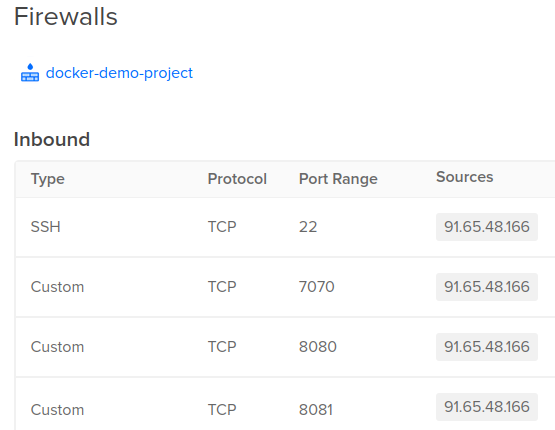
<br />

After that I test access to the Jenkins UI and it works fine:
<br />

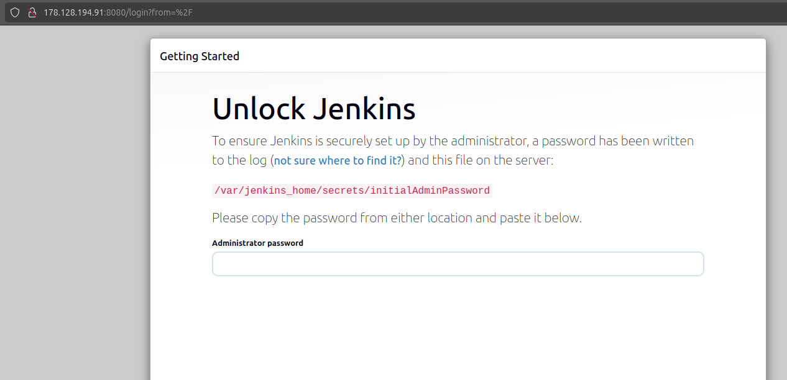
<br />

Use admin password for first loggin and install suggested plugins:
```sh
root@ubuntu-s-1vcpu-2gb-fra1-01:~# cat /var/lib/docker/volumes/jenkins-data/_data/secrets/initialAdminPassword 
9ac5404de******
```
<br />

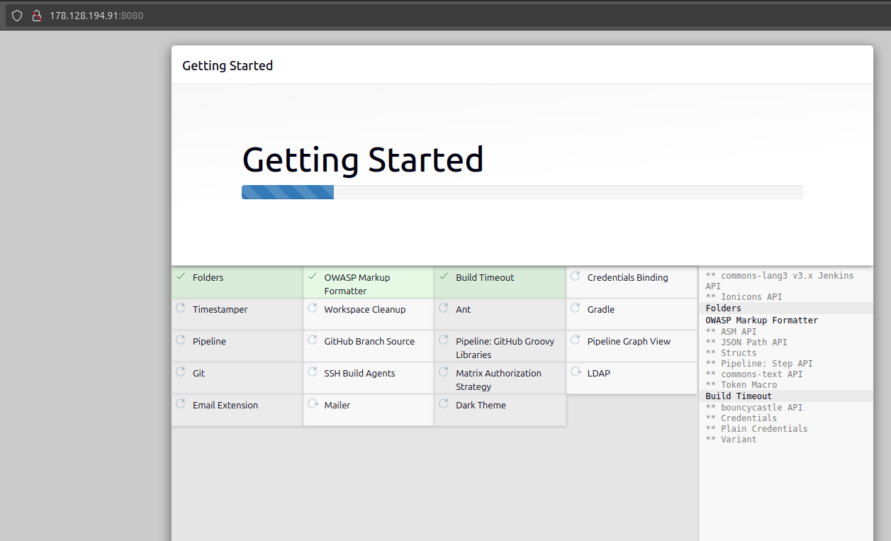
<br />

Create first admin user and start Jenkins:
<br />

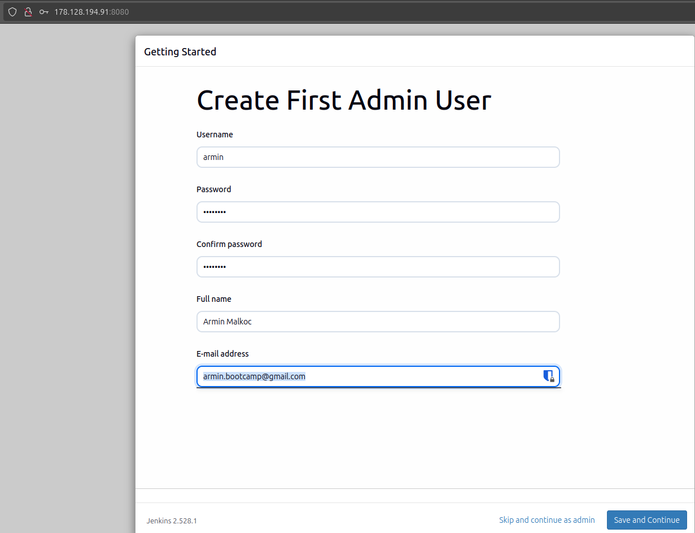

**Setup Jenkins container**

In most of the cases we will need to build our application as Docker Image. In order to be able to run docker commands inside the Jenkins container, we have to provide Docker inside the Jenkins container. 

First what we did we mounted /var/run/docker.sock from our droplet instance to the Jenkins container as we saw earlier. We need one more thing to be able to execute Docker commands from the Jenkins container:

```sh
root@ubuntu-s-1vcpu-2gb-fra1-01:~# docker exec -u root -it jenkins bash
root@a6df85ac312f:/# curl https://get.docker.com/ > dockerinstall && chmod 777 dockerinstall && ./dockerinstall
  % Total    % Received % Xferd  Average Speed   Time    Time     Time  Current
                                 Dload  Upload   Total   Spent    Left  Speed
100 21013  100 21013    0     0   229k      0 --:--:-- --:--:-- --:--:--  230k
# Executing docker install script, commit: e3bd92d5b36b59b39661e4e6d05c786db9bb3ad7
+ sh -c apt-get -qq update >/dev/null
+ sh -c DEBIAN_FRONTEND=noninteractive apt-get -y -qq install ca-certificates curl >/dev/null
+ sh -c install -m 0755 -d /etc/apt/keyrings
+ sh -c curl -fsSL "https://download.docker.com/linux/debian/gpg" -o /etc/apt/keyrings/docker.asc
+ sh -c chmod a+r /etc/apt/keyrings/docker.asc
+ sh -c echo "deb [arch=amd64 signed-by=/etc/apt/keyrings/docker.asc] https://download.docker.com/linux/debian trixie stable" > /etc/apt/sources.list.d/docker.list
+ sh -c apt-get -qq update >/dev/null
+ sh -c DEBIAN_FRONTEND=noninteractive apt-get -y -qq install docker-ce docker-ce-cli containerd.io docker-compose-plugin docker-ce-rootless-extras docker-buildx-plugin docker-model-plugin >/dev/null
+ sh -c docker version
Client: Docker Engine - Community
 Version:           28.5.2
 API version:       1.50 (downgraded from 1.51)
 Go version:        go1.25.3
 Git commit:        ecc6942
 Built:             Wed Nov  5 14:43:33 2025
 OS/Arch:           linux/amd64
 Context:           default

Server:
 Engine:
  Version:          28.2.2
  API version:      1.50 (minimum version 1.24)
  Go version:       go1.23.1
  Git commit:       28.2.2-0ubuntu1~24.04.1
  Built:            Wed Sep 10 14:16:39 2025
  OS/Arch:          linux/amd64
  Experimental:     false
 containerd:
  Version:          1.7.28
  GitCommit:        
 runc:
  Version:          1.3.3-0ubuntu1~24.04.2
  GitCommit:        
 docker-init:
  Version:          0.19.0
  GitCommit:        

================================================================================

To run Docker as a non-privileged user, consider setting up the
Docker daemon in rootless mode for your user:

    dockerd-rootless-setuptool.sh install

Visit https://docs.docker.com/go/rootless/ to learn about rootless mode.


To run the Docker daemon as a fully privileged service, but granting non-root
users access, refer to https://docs.docker.com/go/daemon-access/

WARNING: Access to the remote API on a privileged Docker daemon is equivalent
         to root access on the host. Refer to the 'Docker daemon attack surface'
         documentation for details: https://docs.docker.com/go/attack-surface/

================================================================================

root@a6df85ac312f:/# ls -la /var/run/docker.sock 
srw-rw---- 1 root 112 0 Nov  7 06:24 /var/run/docker.sock
root@a6df85ac312f:/# chmod 666 /var/run/docker.sock 
```
Now if we test if our docker commands work inside the Jenkins container, we'll se they work:

```sh
root@ubuntu-s-1vcpu-2gb-fra1-01:~# docker exec  -it jenkins bash
jenkins@a6df85ac312f:/$ docker ps
CONTAINER ID   IMAGE                 COMMAND                  CREATED          STATUS          PORTS                                                                                          NAMES
a6df85ac312f   jenkins/jenkins:lts   "/usr/bin/tini -- /u…"   24 minutes ago   Up 23 minutes   0.0.0.0:8080->8080/tcp, [::]:8080->8080/tcp, 0.0.0.0:50000->50000/tcp, [::]:50000->50000/tcp   jenkins

jenkins@a6df85ac312f:/$ docker pull redis
Using default tag: latest
latest: Pulling from library/redis
1adabd6b0d6b: Pull complete 
22506777a096: Pull complete 
5dec27664782: Pull complete 
2e60b18d70d8: Pull complete 
729797e636a7: Pull complete 
4f4fb700ef54: Pull complete 
6c981fc7c621: Pull complete 
Digest: sha256:5c7c0445ed86918cb9efb96d95a6bfc03ed2059fe2c5f02b4d74f477ffe47915
Status: Downloaded newer image for redis:latest
docker.io/library/redis:latest
```
So everything is prepared and we can continue with our demo projects.

</details>

******

<details>
<summary>Project: Create a CI Pipeline with Jenkinsfile (Freestyle, Pipeline, Multibranch Pipeline)</summary>
<br />

**Install Build Tools (Maven, Node) in Jenkins**

maven, nodejs and stage view installed 
We installed maven through "Manage Jenkins -> Tools":
<br />

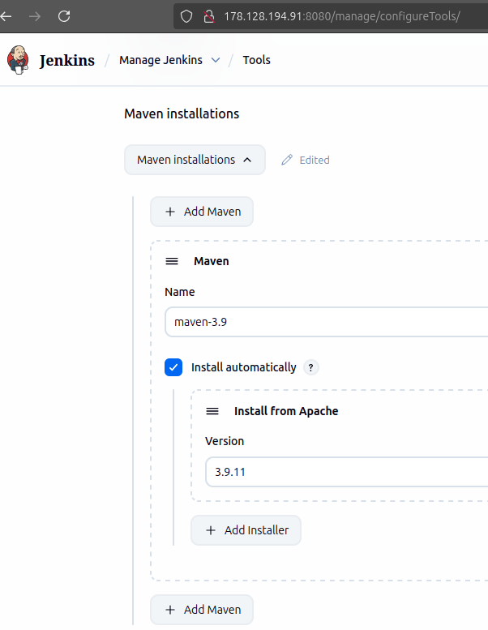
<br />
For the NodeJS, we installed NodeJS plugin 1.6.5 thorugh "Manage Jenkins -> Plugins -> Available Plugins" and then using "Manage Jenkins -> Tools":
<br />

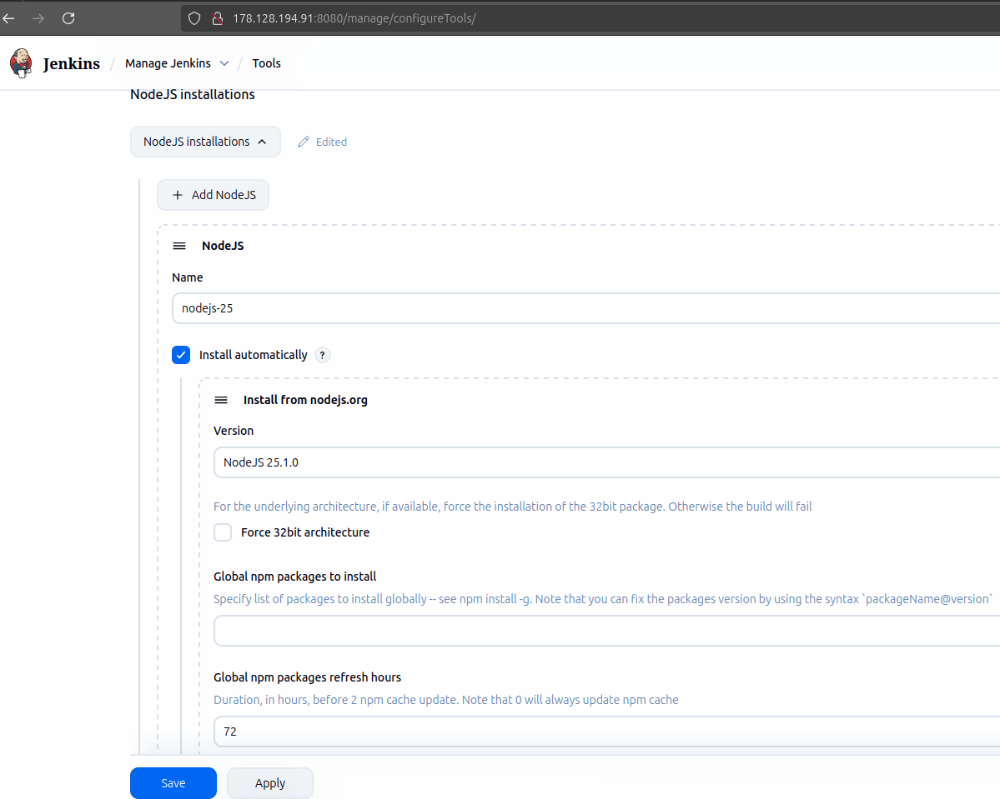
<br />

**Make Docker available on Jenkins server**

We already did it in the previous demo project mounting "/var/run/docker.sock from our host to the Jenkins container, so we've installed both, docker and docker-compose as well:
```sh
jenkins@a6df85ac312f:/$ docker ps
CONTAINER ID   IMAGE                 COMMAND                  CREATED       STATUS         PORTS                                                                                          NAMES
a6df85ac312f   jenkins/jenkins:lts   "/usr/bin/tini -- /u…"   3 hours ago   Up 8 minutes   0.0.0.0:8080->8080/tcp, [::]:8080->8080/tcp, 0.0.0.0:50000->50000/tcp, [::]:50000->50000/tcp   jenkins
jenkins@a6df85ac312f:/$ docker -v
Docker version 28.5.2, build ecc6942
jenkins@a6df85ac312f:/$ ls -la /var/run/docker.sock 
srw-rw-rw- 1 root 112 0 Nov  7 06:24 /var/run/docker.sock
```
<br />

**Create Jenkins credentials for a git repository**
<br />
In this project I'll use GitLab as my code repository.I'll now create credentials for my GitLab repository:
<br />

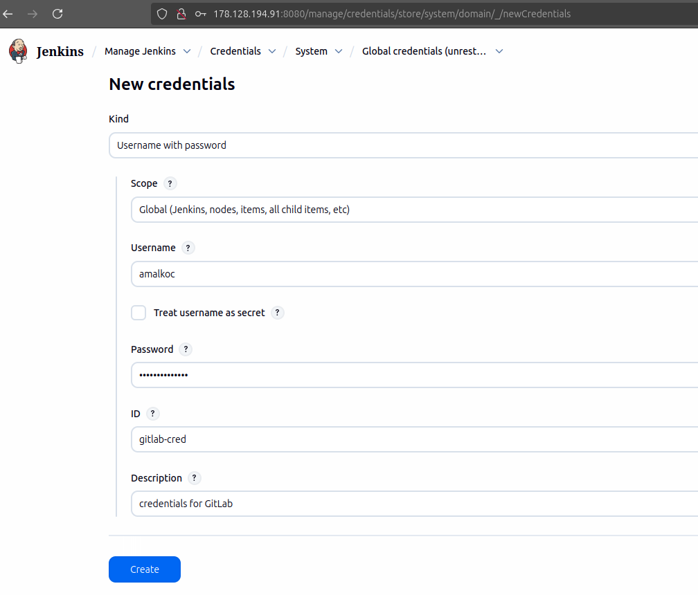
<br />

</details>

******

<details>
<summary>Project: Create different Jenkins job types (Freestyle, Pipeline, Multibranch pipeline) for the Java Maven project</summary>
<br />

**Freestyle Jenkins Job**

I created freestyle type of the Jenkins Job and called it "demo-project-free". In the job configuration, SCM has been configured to use this gitlab repository - https://gitlab.com/twn-armin/jenkins-demo-project/java-maven-app.git. Credentials for GitLab repository have already been created in the "Manage Jenkins -> Credentials -> System -> Gloabal Credentials" in the previous project.
<br />

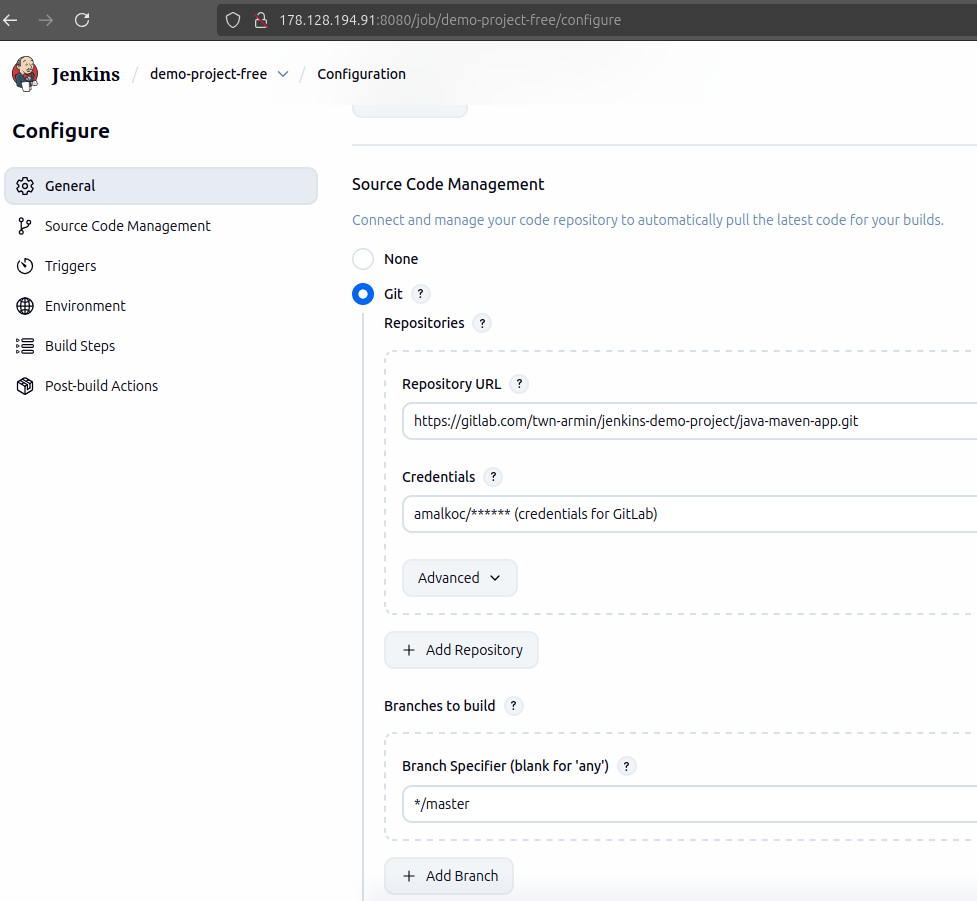
<br />

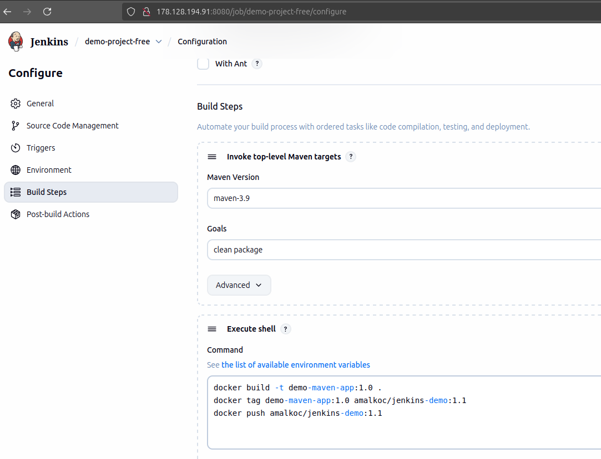

To be able to do push docker image to the DockerHub private repo, I had to do docker login inside the docker container and after that my job was successful and image has been pushed to the DockerHub private repository:
<br />

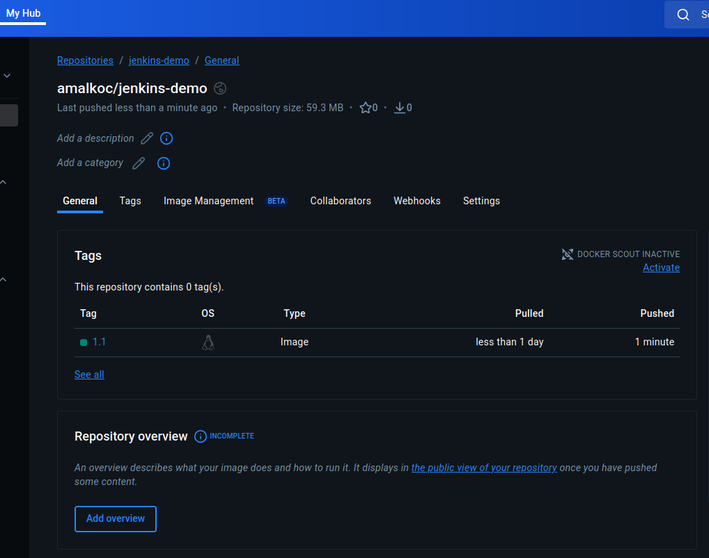
<br />

**Pipeline Job**

I created pipeline job called "demo-project-pipeline" and configures SCM https://gitlab.com/twn-armin/jenkins-demo-project/java-maven-app.git. Credentials for the SCM are previously created. 

In order to be able to push my Docker Image on the DockerHub private repo, I created credentials for the DockerHub in my Jenkins as well. So now, we have everything that is needed for our pipelin.My Jenkinsfile looks like:

```groovy
pipeline {
    agent any
    tools {
        maven 'maven-3.9'
    }

    stages {
        stage("Application Test") {
            steps {
                script {
                    echo "Application Code Test"
                    sh "mvn test"
                }
            }
        }
        stage("Application Build") {
            steps {
                script {
                    echo "Build the application artifact"
                    sh "mvn clean package"
                }
            }
        }
        stage("Build and Push Docker Image") {
            steps {
                withCredentials([usernamePassword(credentialsId: 'dockerHub-private', usernameVariable: 'USER', passwordVariable: 'PASS')]) {
                    sh 'docker build -t amalkoc/jenkins-demo:1.2 .'
                    sh "echo $PASS | docker login -u $USER --password-stdin"
                    sh 'docker push amalkoc/jenkins-demo:1.2'
                }
            }
        }
    }
}
```
I execute my job and it was finished successfuly. Docker Image was pushed to the DockerHub private repository:
<br />

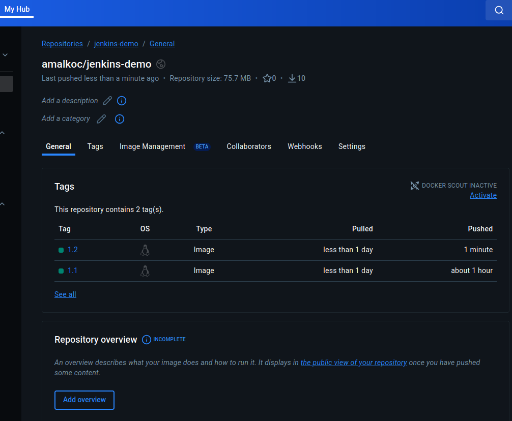
<br />

**Multibranch Pipeline**

I have created two new branches in my repository, bug-fix and feature-dev:
```sh
armin@nb-pf565v12:~/jenkins-demo-project/java-maven-app$ git branch -l
  bug-fix
  feature-dev
* master
```
Now, I'll create new, multibranch, Jenkins job and called it "demo-project-multi" with the "Filter by name (with regular expression)" behavior parameter:
<br />

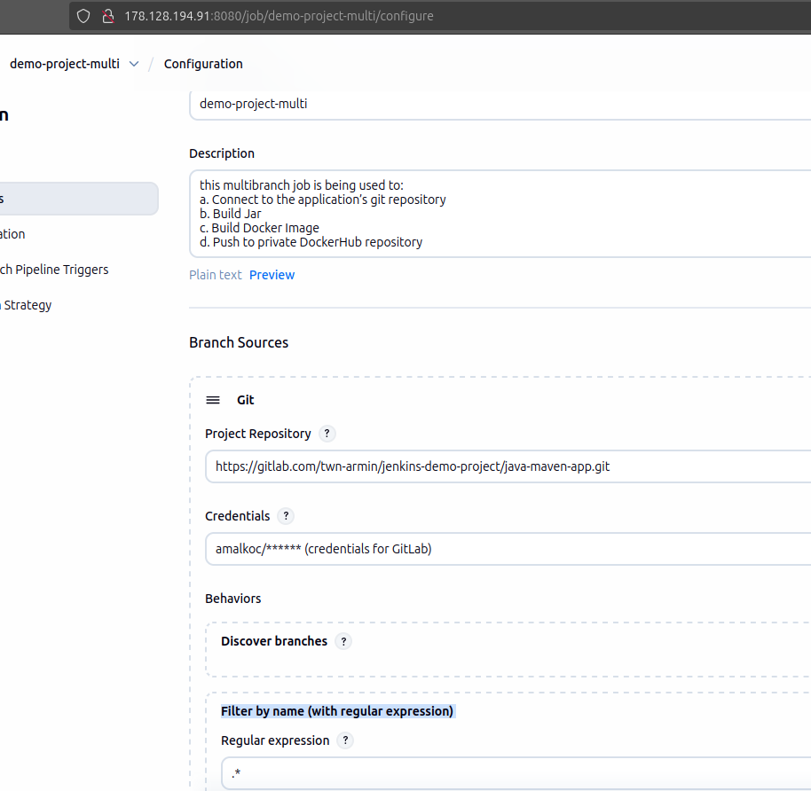
<br />

I rewrote my Jenkinsfile in master branch to do build an artifact and build/push Docker Image only for "master" branch. Master branch has been merged into the other two branches.This is my Jenkinsfile:
```groovy
pipeline {
    agent any
    tools {
        maven 'maven-3.9'
    }

    stages {
        stage("Application Test") {
            steps {
                script {
                    echo "Application Code Test"
                    sh "mvn test"
                }
            }
        }
        stage("Application Build") {
            when {
                expression {
                    BRANCH_NAME == 'master'
                }
            }
            steps {
                script {
                    echo "Build the application artifact"
                    sh "mvn clean package"
                }
            }
        }
        stage("Build and Push Docker Image") {
            when {
                expression {
                    BRANCH_NAME == 'master'
                }
            }
            steps {
                withCredentials([usernamePassword(credentialsId: 'dockerHub-private', usernameVariable: 'USER', passwordVariable: 'PASS')]) {
                    sh 'docker build -t amalkoc/jenkins-demo:1.3 .'
                    sh "echo $PASS | docker login -u $USER --password-stdin"
                    sh 'docker push amalkoc/jenkins-demo:1.3'
                }
            }
        }
    }
}
```
My Jenkins Multibranch job:
<br />

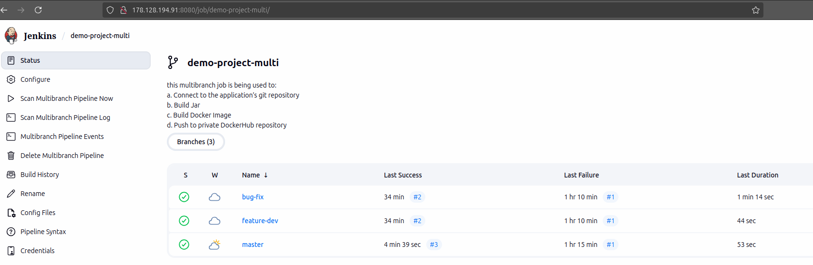

These are to logs of the other two branches:
[bugfix](bugfix-branch-console-log.txt)
[feature](feature-dev-branch-console-log.txt)

I executed multibranch job and saw that build an artifact and docker build/push was done only for master branch. Docker Image was pushed to my DockerHub private repository:
<br />

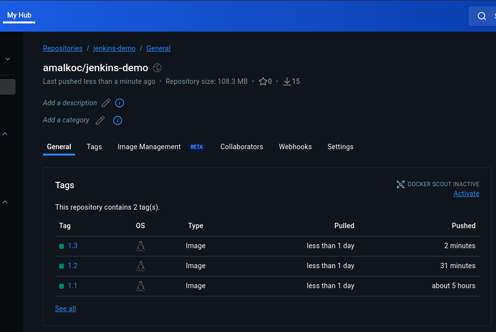

</details>

******

<details>
<summary>Project: Create a Jenkins Shared Library</summary>
<br />

**Create separate Git repository for Jenkins Shared Library project**

First of all, I created new repository for my Jenkins Shared Library - https://gitlab.com/twn-armin/jenkins-demo-project/demo-project-shared-library.git. 

**Create functions in the JSL to use in the Jenkins pipeline**

I defined functions under the vars directory for:
- appTest.groovy (for application test stage)
```groovy
#!/usr/bin/env groovy

def call() {
    echo "Application Code Test"
    sh "mvn test"
}
```
- appBuild.groovy (for build Java Maven artifact .jar)
```groovy
#!/usr/bin/env groovy

def call() {
    echo "Build the application artifact"
    sh "mvn clean package"
}
```
- imageBuildPush (for build and push Docker Image)
```groovy
#!/usr/bin/env groovy

def call() {
    withCredentials([usernamePassword(credentialsId: 'dockerHub-private', usernameVariable: 'USER', passwordVariable: 'PASS')]) {
        sh 'docker build -t amalkoc/jenkins-demo:1.4 .'
        sh "echo $PASS | docker login -u $USER --password-stdin"
        sh 'docker push amalkoc/jenkins-demo:1.4'
    }
}
```
After that I make my Shared Library globaly available in Jenkins:
<br />

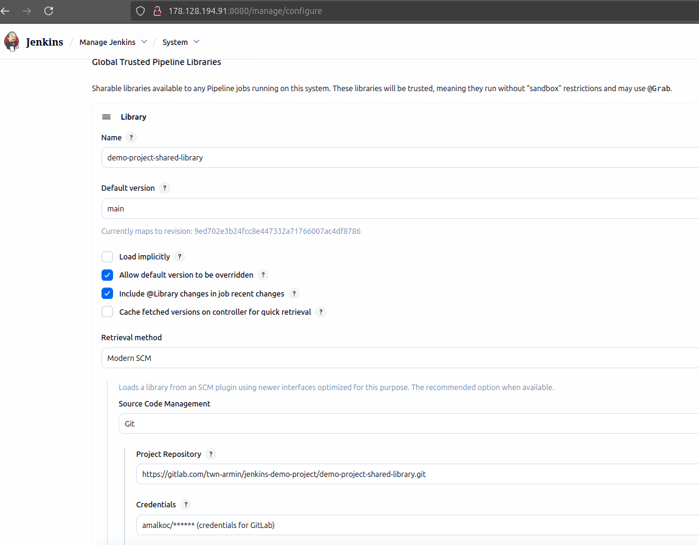

**Integrate and use the JSL in Jenkins Pipeline (globally and for a specific project in Jenkinsfile)**
I referenced my shared library from the Jenkinsfile:
```groovy
@Library('demo-project-shared-library')_

pipeline {
    agent any
    tools {
        maven 'maven-3.9'
    }

    stages {
        stage("Application Test") {
            steps {
                script {
                    appTest()
                }
            }
        }
        stage("Application Build") {
            when {
                expression {
                    BRANCH_NAME == 'master'
                }
            }
            steps {
                script {
                    appBuild()
                }
            }
        }
        stage("Build and Push Docker Image") {
            when {
                expression {
                    BRANCH_NAME == 'master'
                }
            }
            steps {
                imageBuildPush()
            }
        }
    }
}
```
When I execute Jenkins multibranch job, I can see Docker Image version 1.4 was build and pushed to the DockerHub private repository:
<br />

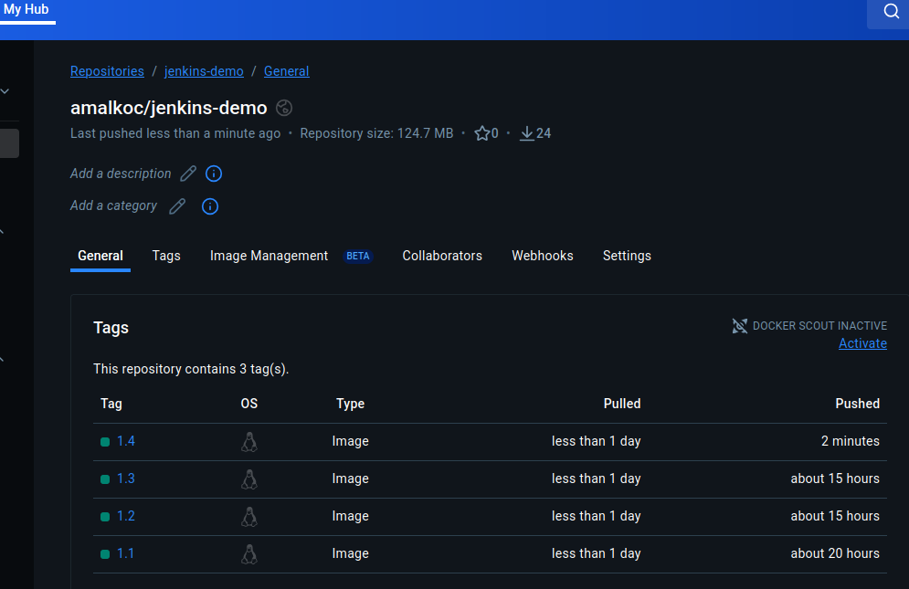

</details>

******

<details>
<summary>Project: Configure Webhook to trigger CI Pipeline automatically on every change</summary>
<br />

