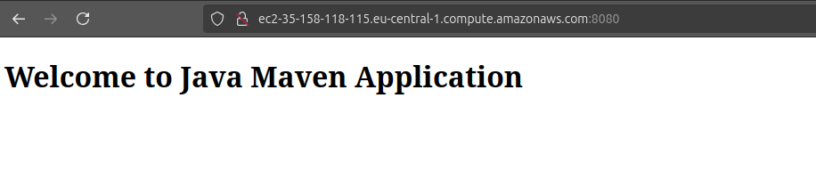
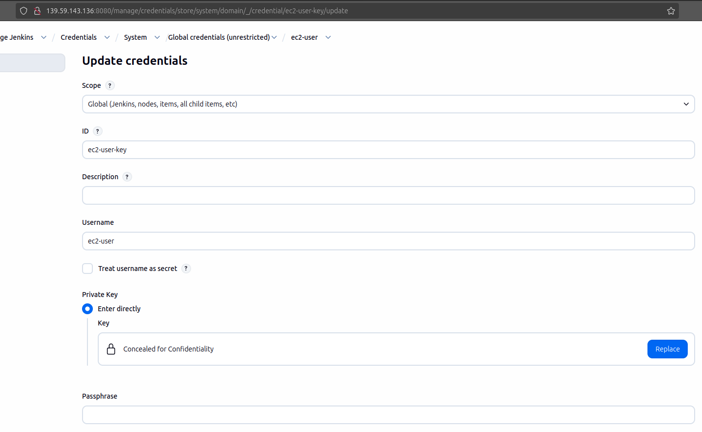
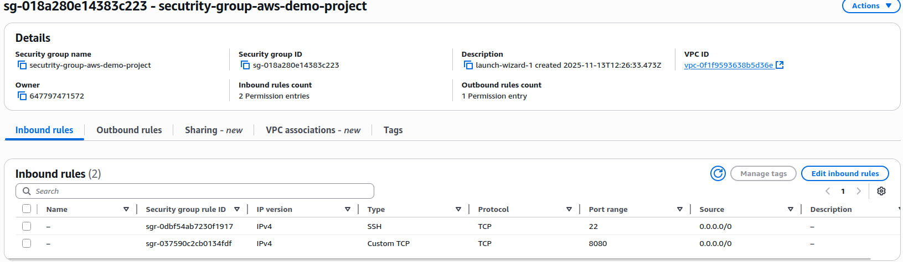

<details>
<summary>Deploy Web Application on EC2 Instance (manually)</summary>
<br />

**Create and configure an EC2 Instance on AWS**

I created EC2 instance using AWS UI but these are it's main parameters:
```sh
armin@nb-pf565v12:~/Downloads/aws$ aws ec2 describe-instances --filters "Name=tag:project, Values=aws-demo" --query "Reservations[].Instances[].Tags[]"
[
    {
        "Key": "Name",
        "Value": "aws-demo"
    },
    {
        "Key": "project",
        "Value": "aws-demo"
    }
]
armin@nb-pf565v12:~/Downloads/aws$ aws ec2 describe-instances --filters "Name=tag:project, Values=aws-demo" --query "Reservations[].ReservationId"
[
    "r-0a1206c8880627fee"
]
armin@nb-pf565v12:~/Downloads/aws$ aws ec2 describe-instances --filters "Name=tag:project, Values=aws-demo" --query "Reservations[].Instances[].BlockDeviceMappings[].Ebs.AttachTime"
[
    "2025-11-13T13:12:03+00:00"
]
armin@nb-pf565v12:~/Downloads/aws$ aws ec2 describe-instances --filters "Name=tag:project, Values=aws-demo" --query "Reservations[].Instances[].NetworkInterfaces[].Groups"
[
    [
        {
            "GroupId": "sg-018a280e14383c223",
            "GroupName": "secutrity-group-aws-demo-project"
        }
    ]
]
armin@nb-pf565v12:~/Downloads/aws$ aws ec2 describe-instances --filters "Name=tag:project, Values=aws-demo" --query "Reservations[].Instances[].NetworkInterfaces[].SubnetId"
[
    "subnet-0c70fadcee6a460a2"
]
armin@nb-pf565v12:~/Downloads/aws$ aws ec2 describe-instances --filters "Name=tag:project, Values=aws-demo" --query "Reservations[].Instances[].NetworkInterfaces[].VpcId"
[
    "vpc-0f1f9593638b5d36e"
]
```
Security group was created as well and it has following permissions:
```sh
armin@nb-pf565v12:~/Downloads/aws$ aws ec2 describe-security-groups --group-ids sg-018a280e14383c223 --query "SecurityGroups[].GroupName"
[
    "secutrity-group-aws-demo-project"
]

armin@nb-pf565v12:~/Downloads/aws$ aws ec2 describe-security-groups --group-ids sg-018a280e14383c223 --query "SecurityGroups[].IpPermissions"
[
    [
        {
            "IpProtocol": "tcp",
            "FromPort": 8080,
            "ToPort": 8080,
            "UserIdGroupPairs": [],
            "IpRanges": [
                {
                    "CidrIp": "0.0.0.0/0"
                }
            ],
            "Ipv6Ranges": [],
            "PrefixListIds": []
        },
        {
            "IpProtocol": "tcp",
            "FromPort": 22,
            "ToPort": 22,
            "UserIdGroupPairs": [],
            "IpRanges": [
                {
                    "CidrIp": "0.0.0.0/0"
                }
            ],
            "Ipv6Ranges": [],
            "PrefixListIds": []
        }
    ]
]
```
NOTE: Port 8080 was opened since it will be needed to acces our application through web browser on port 8080.

VPC details:
```sh
armin@nb-pf565v12:~/Downloads/aws$ aws ec2 describe-vpcs --vpc-ids vpc-0f1f9593638b5d36e
{
    "Vpcs": [
        {
            "OwnerId": "647797471572",
            "InstanceTenancy": "default",
            "CidrBlockAssociationSet": [
                {
                    "AssociationId": "vpc-cidr-assoc-078a765bacad0539a",
                    "CidrBlock": "172.31.0.0/16",
                    "CidrBlockState": {
                        "State": "associated"
                    }
                }
            ],
            "IsDefault": true,
            "BlockPublicAccessStates": {
                "InternetGatewayBlockMode": "off"
            },
            "VpcId": "vpc-0f1f9593638b5d36e",
            "State": "available",
            "CidrBlock": "172.31.0.0/16",
            "DhcpOptionsId": "dopt-0f44fd17e1640b329"
        }
    ]
}
```
Subnet details:
```sh
armin@nb-pf565v12:~/Downloads/aws$ aws ec2 describe-subnets --subnet-ids subnet-0c70fadcee6a460a2
{
    "Subnets": [
        {
            "AvailabilityZoneId": "euc1-az3",
            "MapCustomerOwnedIpOnLaunch": false,
            "OwnerId": "647797471572",
            "AssignIpv6AddressOnCreation": false,
            "Ipv6CidrBlockAssociationSet": [],
            "SubnetArn": "arn:aws:ec2:eu-central-1:647797471572:subnet/subnet-0c70fadcee6a460a2",
            "EnableDns64": false,
            "Ipv6Native": false,
            "PrivateDnsNameOptionsOnLaunch": {
                "HostnameType": "ip-name",
                "EnableResourceNameDnsARecord": false,
                "EnableResourceNameDnsAAAARecord": false
            },
            "BlockPublicAccessStates": {
                "InternetGatewayBlockMode": "off"
            },
            "SubnetId": "subnet-0c70fadcee6a460a2",
            "State": "available",
            "VpcId": "vpc-0f1f9593638b5d36e",
            "CidrBlock": "172.31.32.0/20",
            "AvailableIpAddressCount": 4090,
            "AvailabilityZone": "eu-central-1b",
            "DefaultForAz": true,
            "MapPublicIpOnLaunch": true
        }
    ]
}
```
<br />

**Install Docker on remote EC2 Instance**

Docker has been installed on my EC2 instance and ec2-user was added to the docker group
```sh
[ec2-user@ip-172-31-34-132 ~]$sudo yum install docker.io
[ec2-user@ip-172-31-34-132 ~]$ groups
ec2-user adm wheel systemd-journal docker
[ec2-user@ip-172-31-34-132 ~]$ docker -v
Docker version 25.0.13, build 0bab007

[ec2-user@ip-172-31-34-132 ~]$ systemctl enable docker
[ec2-user@ip-172-31-34-132 ~]$ systemctl start docker

[ec2-user@ip-172-31-34-132 ~]$ sudo usermod -aG docker ec2-user
```
<br />

**Deploy Docker image from private Docker repository on EC2 Instance**

In this demo project I use this repository (master branch) for my java-maven app https://gitlab.com/twn-armin/jenkins-demo-project/java-maven-app.git .

Shared Library is in this repository - https://gitlab.com/twn-armin/jenkins-demo-project/demo-project-shared-library.git .

After Jenkins Job was executed, Docker Image was pushed to the DockerHub private repository:
<br />


In the nex step I manually run Docker Container using following command:
```sh
[ec2-user@ip-172-31-34-132 ~]$ docker .run -d -p 8080:8080 --name maven-app amalkoc/jenkins-demo:1.1.16-14
```

Since my security group was already configured to allow inbound traffin on port 8080, I can access to my app through web UI:
<br />


<br />

</details>

******

<details>
<summary>Project: CD - Deploy Application from Jenkins Pipeline to EC2 Instance (automatically with docker)</summary>
<br />

**Prepare AWS EC2 Instance for deployment (Install Docker)**

I alredy installed Docker in previous Project:
```sh
[ec2-user@ip-172-31-34-132 ~]$ docker -v
Docker version 25.0.13, build 0bab007
```
<br />

**Create ssh key credentials for EC2 server on Jenkins**

First of all I've installed "ssh agent" plugin in Jenkins. After that I created credentials using value of my .pem file for EC2 instance:
<br />



**Extend the previous CI pipeline with deploy step to ssh into the remote EC2 instance and deploy newly built image from Jenkins  server**
<br />

In my previous Jenkinsfile I added deployment step with when expression since I want to do build and deploy just for master branch:
```groovy
stage("Deploy Docker Image to the AWS EC2 instance") {
    when {
        expression {
            BRANCH_NAME == 'master'
            }
        }
        steps {
            script {
                echo "Deploy Docker Image to AWS EC2"
                def dockerCmd = 'docker run -d -p 8080:8080 --name maven-app amalkoc/jenkins-demo:1.1.16-14'
                def user = 'ec2-user'
                def srvIP = '35.158.118.115'
                sshagent(['ec2-user-key']) {
                    sh "ssh -o StrictHostKeyChecking=no ${user}@${srvIP} ${dockerCmd}"
            }
        }
    }
}
```
<br />

**Configure security group on EC2 Instance to allow access to our web application**

I configured my security group to enable access to my web app using port 8080:


<br />

</details>

******

<details>
<summary>Project: CD - Deploy Application from Jenkins Pipeline on EC2 Instance (automatically with docker-compose)</summary>
<br />

